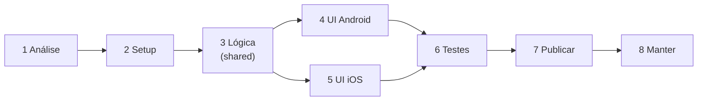

# Roadmap Resumido: TAF CBMRS → Apps Nativos

> Versão enxuta para consulta rápida do dia a dia. Detalhes completos, justificativas e tabelas de mapeamento estão em [roadmap.md](roadmap.md).

## A decisão em uma frase

Compartilhar **só a lógica de cálculo e as tabelas oficiais** entre Android e iOS via **Kotlin Multiplatform (KMP)**; construir a **interface 100% nativa** em cada plataforma (Compose no Android, SwiftUI no iOS). Motivo: as tabelas de pontuação são grandes e transcrevê-las duas vezes à mão é o maior risco do projeto.

## O caminho, em 8 passos

D e E podem rodar em paralelo se houver 2 devs.

---

## Checklist por fase

### 1. Análise (3-4 dias) — ✅ concluída, exceto nomenclatura
- [x] Mapear tudo que o app web faz hoje (formulário, cálculo, tabelas, tema, impressão) — `vault/02 - Produto/`
- [x] Decidir como tratar o que não existe em mobile: impressão → exportar/compartilhar PDF; modal → bottom sheet/sheet nativo — `vault/04 - Mobile/Decisões UX Web → Mobile.md`
- [x] Confirmar a decisão de arquitetura (KMP) e definir estrutura de repositório — `vault/04 - Mobile/ADR-001...` e `Estrutura do Repositório Mobile.md`
- [x] Tokens visuais e escopo do MVP documentados — `vault/04 - Mobile/Tokens Visuais.md`, `Escopo do MVP Mobile.md`
- [x] Nome do app definido: **"Calc TAF"** (neutro)
- [ ] Bundle ID — adiado para a Fase 2

### 2. Setup (2-3 dias) — ✅ concluída e validada (Android/shared)
- [x] Módulo `shared` (KMP) + `androidApp` (Compose) criados; stubs Swift para `iosApp`
- [x] CI configurado (`.github/workflows/mobile-ci.yml`), agora usando `./gradlew`
- [x] **Spike de validação real — confirmado em 2026-08-30:** `:shared:jvmTest` passou e `:androidApp:assembleDebug` gerou um APK real, depois de instalar o Android Studio. Precisou subir Gradle/AGP/Kotlin bem além do previsto por causa do JDK 25 do Android Studio — detalhes em `mobile/SETUP.md`. iOS segue pendente (só via CI/macOS)

### 3. Migrar a lógica de negócio (5-7 dias) — ✅ concluída, validada, e achou um bug real
- [x] 9 tabelas transcritas para Kotlin (`TafData.kt`)
- [x] Golden-master test rodando e passando (2/2) — compara contra JSON exportado do `taf-data.ts` original
- [x] Funções de `taf-utils.ts` portadas (`TafCalculator.kt`) + cálculo de idade (`AgeCalculator.kt`)
- [x] 58 testes escritos **antes** de cada implementação (TDD real, Red confirmado antes de cada Green) — todos passando
- [x] **Bug real encontrado e corrigido:** militares 40+ sempre tiravam 0 no teste de força superior (Apoio Solo/Joelhos) por um erro de indexação em `calculatePoints`. Corrigido no web com TDD (Vitest, configurado agora pela primeira vez) e validado rodando o app de verdade no navegador — não só nos testes. Kotlin já nasceu com a versão corrigida. Detalhes: `vault/03 - Técnico/Regras de Negócio.md`

### 4. UI Android — Compose (8-10 dias)
- [ ] Telas: formulário (identificação + testes), card de resultado, modal de tabelas de referência
- [ ] Validações e mensagens de erro/aviso iguais às do web
- [ ] Tema claro/escuro, animações (contador de nota, ícone de reset)
- [ ] Impressão → gerar PDF + `Intent.ACTION_SEND`

### 5. UI iOS — SwiftUI (8-10 dias, paralelo à 4)
- [ ] Mesmas telas e regras, adaptadas a HIG
- [ ] Tema claro/escuro, animações equivalentes
- [ ] Impressão → PDF + share sheet (cobre AirPrint automaticamente)

### 6. Testes (5-7 dias)
- [ ] Unitários do `shared`: casos de fronteira de cada faixa etária e cada corte de conceito (10.0/8.5/7.0/5.0)
- [ ] UI: fluxo completo em Compose UI Test e XCUITest
- [ ] **Teste de paridade:** mesmas entradas no Android e no iOS devem dar exatamente o mesmo resultado
- [ ] Dispositivos reais + acessibilidade (TalkBack/VoiceOver)
- [ ] Beta fechado com usuários reais antes de submeter às lojas

### 7. Publicação (3-5 dias + fila de revisão)
- [ ] Play Store: conta de dev, ficha da loja, ícones/screenshots, formulário de dados (declarar "nenhum dado coletado"), AAB assinado
- [ ] App Store: conta Apple Developer, App Privacy (nenhum dado coletado), ícones/screenshots, TestFlight, submissão
- [ ] Política de privacidade publicada (pode ser página simples — app é 100% offline)

### 8. Pós-lançamento (contínuo)
- [ ] Monitorar crashes (Firebase Crashlytics ou Sentry)
- [ ] Canal de feedback/suporte
- [ ] Processo para atualizar tabelas se a IR for revisada: só mexe no `shared`, os dois apps saem sincronizados

---

## Prazos

| Cenário | Duração total |
|---|---|
| 1 desenvolvedor (sequencial) | ~36-46 dias úteis (7-9 semanas) |
| 2 desenvolvedores (Android e iOS em paralelo) | ~26-33 dias úteis (5-7 semanas) |

## Os 3 riscos que mais importam

1. **Erro de transcrição nas tabelas oficiais** → mitigado pelo golden-master test (fase 3, não é opcional)
2. **Equipe sem experiência em KMP** → mitigado pelo spike de 0,5 dia na fase 2 antes de comprometer o cronograma
3. **App Store rejeitar por "app simples demais"** → mitigado com descrição clara do uso institucional oficial (CBMRS/IR 001/2024)

## O que NÃO muda / NÃO entra no escopo

- Nenhuma funcionalidade nova além do que já existe no app web
- Sem backend, conta de usuário, sincronização ou notificações push — permanece 100% offline
- Dependências não usadas hoje (`@google/genai`, `express`, `dotenv`) não são portadas
