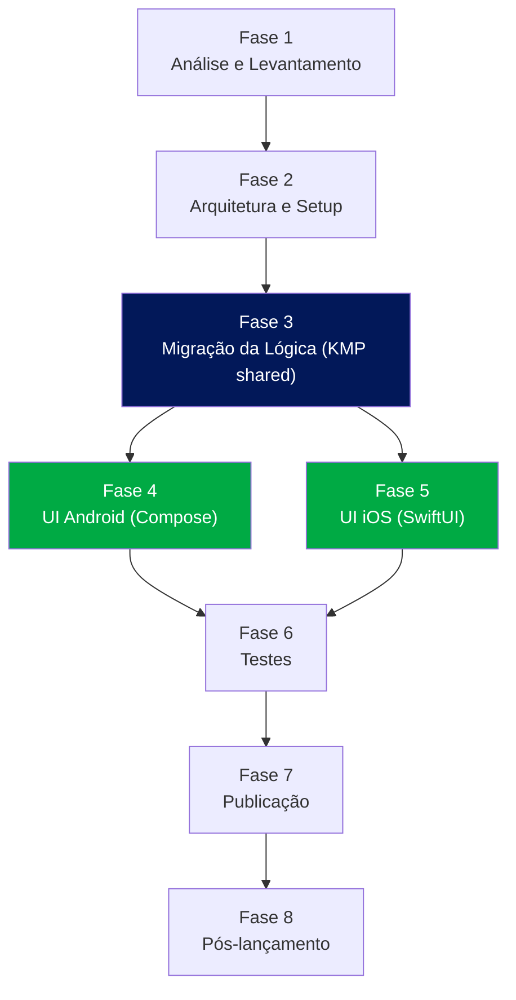

# Roadmap: Transformação da Calculadora TAF CBMRS em Aplicativos Nativos (Android + iOS)

> Documento de planejamento técnico. Não contém código-fonte — apenas o plano de ação para a migração.
> Base de análise: `src/App.tsx`, `src/lib/taf-utils.ts`, `src/constants/taf-data.ts`, `package.json`, `README.md` (estado do repositório em 2026-08-30).

---

## Sumário Executivo

A Calculadora TAF CBMRS é uma SPA React 19 + TypeScript, 100% client-side, sem backend, cuja complexidade real está concentrada em ~100 linhas de regras de negócio (`taf-utils.ts`) e ~300 linhas de tabelas de pontuação oficiais estáticas (`taf-data.ts`). A camada de UI (shadcn/ui sobre Base UI + Tailwind + Motion) é rica em micro-interações, mas funcionalmente simples: um formulário, um card de resultado e um modal de tabelas de referência.

**Recomendação arquitetural:** usar **Kotlin Multiplatform (KMP)** para compartilhar exclusivamente a camada de regras de negócio e as tabelas de dados entre Android e iOS, mantendo a interface **100% nativa** em cada plataforma (Jetpack Compose no Android, SwiftUI no iOS). A justificativa central é o risco de integridade: as tabelas de pontuação são numerosas, longas e citam página específica da IR 001/2024 — transcrevê-las duas vezes manualmente (uma em Kotlin, outra em Swift) é o tipo de tarefa repetitiva onde erros de transcrição são prováveis e, neste domínio (aprovação/reprovação em teste físico militar), têm consequência real. Compartilhar essa camada elimina essa classe de risco por construção, sem forçar a UI a abrir mão de idioms nativos.

**Duração estimada:** ~41 dias úteis com 1 desenvolvedor full-stack mobile atuando sequencialmente, ou ~32 dias úteis com 2 desenvolvedores (1 focado em Android, 1 em iOS) a partir da Fase 4. Ver [Estimativas Consolidadas](#estimativas-consolidadas).

**Escopo:** paridade funcional completa com o app web existente — nenhuma funcionalidade nova é adicionada (ver [Suposições Assumidas](#suposições-assumidas) para as únicas adaptações necessárias por diferença de plataforma, como impressão → exportar/compartilhar PDF).

---

## Diagrama de Dependências entre Fases

F4 e F5 podem correr em paralelo (equipes/devs distintos) pois ambas dependem apenas do módulo `shared` da Fase 3 estar concluído e testado.

---

## Decisão Arquitetural: KMP vs. Codebases Separadas

| Critério | Codebases 100% separadas (Kotlin + Swift, sem compartilhamento) | **Kotlin Multiplatform (recomendado)** |
|---|---|---|
| Risco de erro nas tabelas oficiais | Alto — cada tabela (9 tabelas, ~19 linhas × 10 colunas cada) é transcrita duas vezes manualmente | Baixo — tabela escrita uma vez em `commonMain`, consumida por ambas plataformas |
| Consistência de cálculo entre plataformas | Depende de disciplina manual e testes de paridade constantes | Garantida por construção (mesmo código executa nos dois lados) |
| Curva de aprendizado da equipe | Nenhuma adicional (Kotlin puro / Swift puro, ferramentas já conhecidas) | Configuração de projeto KMP, Gradle multiplataforma, geração de XCFramework para iOS |
| Complexidade de build/CI | Baixa | Média (build do shared precisa rodar antes do build iOS; passos extras no CI) |
| Manutenção futura (ex.: nova versão da IR) | Atualizar 2 lugares, risco de divergência | Atualizar 1 lugar (`shared`), ambos apps recompilam com a nova tabela |
| Nativeness da UI | Total (Compose puro / SwiftUI puro) | Total (Compose puro / SwiftUI puro) — KMP aqui só afeta a camada de lógica, não a UI |
| Esforço adicional de setup inicial | ~1 dia | ~2-3 dias (mitigado com spike de validação na Fase 2) |

**Conclusão:** como a lógica é puramente computacional (sem I/O, sem chamadas de plataforma, sem dependência de APIs nativas) e o maior risco do projeto é a fidelidade das tabelas oficiais, KMP é a escolha de menor risco total, mesmo considerando o custo de setup. Se a Fase 2 revelar bloqueios sérios de toolchain (ex.: ambiente CI não suporta compilação Kotlin/Native para iOS), o plano de contingência é cair para codebases separadas com um processo obrigatório de *golden-master testing* (ver Fase 6) para mitigar o risco de divergência — mas essa é a opção B, não a recomendada.

A UI **não** será compartilhada (sem Compose Multiplatform para iOS): o app deve seguir Material Design no Android e HIG no iOS de forma genuína, e a superfície de UI aqui é pequena o suficiente (3 telas efetivas) para não justificar o compartilhamento.

---

## Fase 1 — Análise e Levantamento

**Estimativa: 3-4 dias | Dependências: nenhuma**

- [x] Mapear 1:1 todas as funcionalidades do web app a partir de `App.tsx`, `taf-utils.ts` e `taf-data.ts`: identificação (sexo, nascimento, data do TAF, idade), testes de força superior (4 variantes), abdominal, corrida 12min, natação 50m opcional, cálculo de pontos, nota final ponderada, conceito, aprovação/reprovação, modal de tabelas, tema claro/escuro, impressão — ver `vault/02 - Produto/Funcionalidades Atuais (Web).md`
- [x] Documentar as regras de negócio em linguagem de domínio (não código) para servir de especificação neutra de plataforma: faixas etárias, regra de seleção do teste de força (idade ≤39 vs. >39, sexo M/F), fórmula da nota final (`(força + abdominal + 2×corrida) / 4`, ou `/5` com natação), limites do conceito (10.0/8.5/7.0/5.0) — ver `vault/03 - Técnico/Regras de Negócio.md`
- [x] Levantar diferenças inevitáveis de UX web→mobile e decidir tratamento de cada uma — decisões registradas em `vault/04 - Mobile/Decisões UX Web → Mobile.md`:
  - "Imprimir" (`window.print()`) → PDF nativo + compartilhamento do sistema (Print Framework/Android, `UIGraphicsPDFRenderer`+share sheet/iOS)
  - Modal de tabelas (Dialog + Tabs) → Bottom Sheet (Android) / `.sheet` (iOS), alinhado ao comportamento que o CSS atual já emula em telas pequenas
  - Popover de ajuda (`InfoTooltip`) → `TooltipBox` (Compose) / `.popover()` (SwiftUI), acionado por toque
  - Estilo "neumórfico" → adaptado para Material 3 (tonal elevation) e HIG (materiais), preservando paleta e raios de borda, não a técnica de sombra
- [x] Definir MVP mobile = paridade funcional 100% com o web, sem funcionalidades adicionais — ver `vault/04 - Mobile/Escopo do MVP Mobile.md`
- [x] Levantar tokens visuais atuais para adaptação (não portar CSS diretamente) — ver `vault/04 - Mobile/Tokens Visuais.md` (inclui inconsistência encontrada no `--primary` do modo escuro, a confirmar antes de fixar no tema nativo)
- [x] Decisão arquitetural formal (ver seção acima) — registrada como `vault/04 - Mobile/ADR-001 KMP vs Codebases Separadas.md`
- [x] Definir estrutura de repositório: monorepo único — ver `vault/04 - Mobile/Estrutura do Repositório Mobile.md`
- [x] Nome de exibição do app: definido como **"Calc TAF"** (nome neutro, sem usar a sigla "CBMRS" enquanto não houver autorização institucional confirmada — ver `vault/01 - Negócio/Modelo de Negócio.md`)
- [ ] Bundle ID/package name — decisão adiada para a Fase 2 (Setup); ver alternativa sem dependência institucional em `vault/04 - Mobile/Estrutura do Repositório Mobile.md`

**Fase 1 concluída em 2026-08-30.**

---

## Fase 2 — Arquitetura e Setup do Projeto

**Estimativa: 2-3 dias | Dependências: Fase 1**

- [x] **Spike de validação — confirmado em 2026-08-30:** `:shared:jvmTest` (passou) e `:androidApp:assembleDebug` (gerou APK) rodaram de verdade nesta máquina via `./gradlew`, depois que o Android Studio foi instalado. Precisou subir versões (Gradle 9.7.1, AGP 9.3.2, Kotlin 2.4.10, compileSdk 37) por causa do JDK 25 embutido no Android Studio — motivo de cada ajuste documentado em `mobile/SETUP.md`. iOS segue não verificável em Windows (só via CI/macOS)
- [x] Módulo `shared` criado com source sets `commonMain`/`commonTest` (vazio de lógica de propósito — a lógica real é Fase 3), alvos `jvm()` (testes rápidos), `androidTarget()`, `iosX64`/`iosArm64`/`iosSimulatorArm64`
- [x] Módulo `androidApp` configurado: Kotlin, Jetpack Compose, Compose Material 3, dependência em `:shared`, tema com os tokens de `vault/04 - Mobile/Tokens Visuais.md`
- [x] Stubs Swift de referência para o `iosApp` (`CalcTAFApp.swift`, `ContentView.swift`, tokens de cor) — **projeto Xcode real ainda não existe**, só pode ser criado em macOS; passos documentados em `mobile/iosApp/README.md`
- [ ] `kotlinx-datetime` no `commonMain` — adiado para a Fase 3, junto com o cálculo de idade que vai usá-lo (evita dependência sem uso na Fase 2)
- [x] CI (GitHub Actions) configurado: job `shared` (testes JVM), job `android` (build debug), job `ios-framework` (build do XCFramework em runner macOS) — `.github/workflows/mobile-ci.yml`
- [x] Convenção de versionamento semântico e estratégia de branches — `vault/04 - Mobile/Convenções de Versionamento e Branches.md`
- [x] Tokens de design como constantes compartilháveis conceitualmente — já documentado em `vault/04 - Mobile/Tokens Visuais.md` (Fase 1) e agora também implementado como `Color.kt`/`Theme.kt` (Android) e `Colors.swift` (iOS)

**Fase 2 concluída e validada para Android/shared** (ver `mobile/SETUP.md`). iOS ainda depende de CI/macOS para confirmação. Próxima fase: 3 — Migração da Lógica de Negócio (TDD obrigatório, ver `CLAUDE.md`).

---

## Fase 3 — Migração da Lógica de Negócio (módulo `shared`)

**Estimativa: 5-7 dias | Dependências: Fase 2**

Esta é a fase de maior criticidade de qualidade — qualquer divergência aqui produz resultado de aprovação/reprovação incorreto em produção.

### Mapeamento de tipos e dados (`taf-data.ts` → `commonMain`)

| Origem (TypeScript) | Destino (Kotlin, `commonMain`) |
|---|---|
| `type AgeGroup` (union de 10 strings) | `enum class AgeGroup` com 10 valores, na mesma ordem |
| `const AGE_GROUPS: AgeGroup[]` | `val AGE_GROUPS: List<AgeGroup>` |
| `interface ScoringTable { [points: string]: number[] }` | `typealias ScoringTable = Map<Double, List<Double>>` (chave = pontos, valor = limiares por faixa etária, na ordem de `AGE_GROUPS`) |
| `ABDOMINAL_MALE`, `ABDOMINAL_FEMALE` | `object` com `val` — transcrição direta, 19 linhas cada |
| `BARRA_MALE`, `BARRA_ISOMETRICA_FEMALE` | idem — atenção aos valores fracionários da isométrica feminina (`1.1`) |
| `APOIO_SOLO_MALE`, `APOIO_JOELHOS_FEMALE` | idem — 20 linhas cada, incluindo pontuação `0.5` |
| `CORRIDA_MALE`, `CORRIDA_FEMALE` | idem — as maiores tabelas (44 e 46 linhas); atenção especial na transcrição |
| `NATACAO_MALE`, `NATACAO_FEMALE` | idem — 20 linhas cada, `lowerIsBetter` |

- [ ] Transcrever todas as 9 tabelas para Kotlin, preservando exatamente a ordem de `AGE_GROUPS` em cada array de limiares
- [ ] **Validação automatizada de fidelidade (obrigatória, não opcional):** escrever um script Node (`tsx` já está no `devDependencies`) que importa `taf-data.ts` e serializa todas as tabelas para JSON; comparar programaticamente (assert de igualdade) esse JSON contra os valores transcritos em Kotlin via teste `commonTest`. Isso elimina a necessidade de revisão manual linha-a-linha e barra qualquer PR com divergência
- [ ] Revisão cruzada por uma segunda pessoa nas tabelas antes de considerar a Fase 3 concluída, além do teste automatizado

### Mapeamento de funções (`taf-utils.ts` → `commonMain`)

| Função original | Assinatura Kotlin equivalente | Observação de portabilidade |
|---|---|---|
| `getAgeGroup(age: number): AgeGroup` | `fun getAgeGroup(age: Int): AgeGroup` | Cadeia de `if` idêntica, cortes em 19/24/29/34/39/44/49/54/59 |
| `calculatePoints(value, ageGroup, table, lowerIsBetter?)` | `fun calculatePoints(value: Double, ageGroup: AgeGroup, table: ScoringTable, lowerIsBetter: Boolean = false): Double` | Ordenar chaves decrescente, pular limiar `0` (sentinela "não listado"), mesma lógica de comparação `>=`/`<=` |
| `getUpperBodyTest(sex, age): string` | `fun getUpperBodyTest(sex: Sex, age: Int): String` | Mesmos 4 rótulos textuais (rótulo pode virar chave de string localizada em vez de texto fixo, ver Fase 4/5) |
| `calculateFinalScore(upperBody, abdominal, run, swim?)` | `fun calculateFinalScore(upperBody: Double, abdominal: Double, run: Double, swim: Double? = null): Double` | Peso 2 na corrida; divisor 4 ou 5 conforme presença de natação |
| `getConcept(score): string` | `fun getConcept(score: Double): Concept` (enum: EXCELENTE, MUITO_BOM, BOM, REGULAR, INSUFICIENTE) | Cortes em 10.0/8.5/7.0/5.0 |
| `getUpperBodyTable`, `getAbdominalTable`, `getRunTable`, `getSwimTable` | equivalentes diretos | Seleção de tabela por sexo/idade, sem lógica adicional |

- [ ] Portar `getAgeGroup`, `calculatePoints`, `getUpperBodyTest`, `calculateFinalScore`, `getConcept` e os 4 seletores de tabela como funções puras em um `object TafCalculator` (ou equivalente) no `commonMain`
- [ ] Portar a lógica de cálculo de idade a partir de data de nascimento + data do teste (presente em `App.tsx`, não em `taf-utils.ts`) para o `shared`, usando `kotlinx-datetime.LocalDate`, preservando a regra de ajuste por mês/dia e o clamp de aceitação (18-70 anos)
- [ ] Escrever testes unitários (`commonTest`, `kotlin.test`) cobrindo casos de fronteira de cada função **antes** de iniciar a Fase 4/5 (ver detalhes na Fase 6) — não avançar para UI com lógica não testada
- [ ] Gerar e publicar o `.xcframework` do `shared` como artefato de CI, consumível pelos dois apps

---

## Fase 4 — Desenvolvimento da UI Android (Jetpack Compose)

**Estimativa: 8-10 dias | Dependências: Fase 3 (shared testado e estável)**

### Mapeamento de componentes shadcn/Base UI → Compose

| Componente web (`@/components/ui/*`) | Equivalente Compose (Material 3) |
|---|---|
| `Card`, `CardHeader`, `CardContent`, `CardFooter` | `Card` / `ElevatedCard` com `Column` interna equivalente |
| `Input` (`type="number"`, `type="date"`) | `OutlinedTextField` com `KeyboardType.Number`; para data, `DatePicker`/`DatePickerDialog` (M3) |
| `Select` | `ExposedDropdownMenuBox` |
| `Checkbox` | `Checkbox` |
| `Button` (variants `default`/`ghost`/`outline`) | `Button` / `TextButton` / `OutlinedButton` |
| `Alert`, `AlertDescription` (erros/avisos) | `Text` com cor de erro + `Icon`, ou `Snackbar` para feedback transiente |
| `Popover` (tooltip de ajuda) | `TooltipBox` com `PlainTooltip` (M3), acionado por toque longo/clique no ícone |
| `Table`, `TableHeader`, `TableRow`, `TableCell` (com sticky header e sticky first column) | Composable customizado: `LazyRow`/`LazyColumn` combinados, ou `LazyVerticalGrid` com `stickyHeader`; a coluna "Pts" fixa exige composição manual (duas `LazyColumn` sincronizadas via `LazyListState` compartilhado, ou biblioteca de terceiros para tabela com eixos fixos) |
| `Dialog` + `Tabs` (modal de tabelas de referência) | `ModalBottomSheet` (M3) contendo `TabRow` + `HorizontalPager` |
| Ícones Lucide React | Material Symbols/Icons equivalentes (mapear ícone a ícone: `Calculator`, `User`, `Calendar`, `Dumbbell`, `Timer`, `Activity`, `Waves`, `Info`, `RotateCcw`, `CheckCircle2`, `AlertCircle`, `Printer`, `Sun`/`Moon`) |

### Telas e comportamento

- [ ] Tela única "Calculadora" replicando a estrutura do `App.tsx`: cabeçalho com toggle de tema e botão de tabelas, card de identificação (sexo, nascimento, data do TAF, idade — com cálculo automático reativo), card de testes de força/abdominal, card de resistência (corrida + checkbox de natação com campo condicional animado), botões "Calcular"/"Limpar"
- [ ] Validação de campos replicando exatamente as regras de `handleCalculate`: obrigatoriedade, e os avisos não-bloqueantes (ex.: força >250, abdominal >150, corrida <500m ou >6000m, natação <15s ou >600s) — usar `Text` de erro (`role = liveRegion` equivalente para acessibilidade, mirroring o `aria-live="polite"` do web)
- [ ] Card de resultado com contador animado da nota final (`Animatable<Float>` + easing customizado replicando a curva `[0.22, 1, 0.36, 1]` usada no Motion via `CubicBezierEasing(0.22f, 1f, 0.36f, 1f)`), breakdown por modalidade (força/abdominal/corrida/natação), badge de conceito colorido, indicador Aprovado/Reprovado (nota mínima 5,0)
- [ ] Animação de rotação do ícone de reset ao limpar formulário (`Animatable` de rotação 0→-360°)
- [ ] Modal/bottom sheet de tabelas de referência com abas (Força Sup., Abdominal, Corrida, Natação), destacando a coluna da faixa etária atual e a linha da pontuação obtida — replicar `≥`/`≤` conforme `lowerIsBetter`
- [ ] Tema claro/escuro via `isSystemInDarkTheme()` + toggle manual persistido (`DataStore` — armazenamento local simples, sem backend)
- [ ] "Imprimir" → gerar PDF via `PdfDocument`/`PrintedPdfDocument` replicando o cabeçalho institucional (CBMRS, TAF CBMRS, data do TAF, idade, sexo) visível apenas no PDF/impressão, e abrir via `Intent.ACTION_SEND` ou `PrintManager`
- [ ] Suporte a Talkback: `contentDescription` em todos os ícones/botões de ação, agrupamento semântico dos cards
- [ ] Testar em pelo menos 3 tamanhos de tela (compacto, médio, expandido) já que o layout original é responsivo (`md:grid-cols-2`, `md:grid-cols-4`)

---

## Fase 5 — Desenvolvimento da UI iOS (SwiftUI)

**Estimativa: 8-10 dias | Dependências: Fase 3 (shared testado e estável) — pode rodar em paralelo à Fase 4**

### Mapeamento de componentes shadcn/Base UI → SwiftUI

| Componente web | Equivalente SwiftUI (HIG) |
|---|---|
| `Card` e variantes | `VStack`/`Group` com `.background(.regularMaterial)` ou `RoundedRectangle` + sombra sutil, seguindo Material do HIG |
| `Input` numérico | `TextField` com `.keyboardType(.decimalPad)` |
| `Input` de data | `DatePicker` (`.datePickerStyle(.compact)` ou `.graphical` conforme contexto) |
| `Select` (sexo) | `Picker` com `.pickerStyle(.segmented)` ou `Menu` |
| `Checkbox` (natação) | `Toggle` estilizado como checkbox (SwiftUI não tem checkbox nativo — usar `Toggle` com `ToggleStyle` customizado minimalista, sem reinventar controle) |
| `Button` variants | `Button` com `.buttonStyle(.borderedProminent)` / `.bordered` / `.plain` |
| `Alert`/mensagens de erro | `Text` com cor semântica + `Label` (ícone + texto), inline (não usar `Alert` modal do SwiftUI, que é para diálogos bloqueantes) |
| `Popover` de ajuda | `.popover(isPresented:)` nativo |
| `Table` de referência | `Table` nativo do SwiftUI (disponível desde iOS 16 para iPad/Mac; em iPhone usar `ScrollView` horizontal + `LazyVGrid` com header fixo via `pinnedViews: [.sectionHeaders]`) |
| `Dialog` + `Tabs` (modal de tabelas) | `.sheet(isPresented:)` contendo `TabView(selection:)` com `.tabViewStyle(.page)` ou `Picker(.segmented)` + conteúdo condicional |
| Ícones Lucide React | SF Symbols equivalentes (`function`, `person`, `calendar`, `dumbbell`, `timer`, `figure.run`, `figure.pool.swim`, `info.circle`, `arrow.counterclockwise`, `checkmark.circle`, `exclamationmark.circle`, `printer`, `sun.max`/`moon`) |

### Telas e comportamento

- [ ] Tela única replicando a estrutura do web: seguir o mesmo agrupamento de seções (identificação, força/abdominal, resistência, resultado)
- [ ] Mesma lógica de validação e mensagens de erro/aviso do Android (consumindo o mesmo `shared`, os valores-limite são idênticos por construção)
- [ ] Contador animado da nota final via `withAnimation(.timingCurve(0.22, 1, 0.36, 1, duration: 0.8))` sobre um `@State` numérico observado por um `Text` formatado
- [ ] Card de resultado com breakdown, badge de conceito e indicador Aprovado/Reprovado, espelhando as mesmas cores semânticas do Android (mesma paleta de tokens definida na Fase 2)
- [ ] Modal de tabelas de referência com destaque de coluna/linha ativa, mesma UX do Android adaptada a HIG (uso de `sheet` com `.presentationDetents([.large])`)
- [ ] Tema claro/escuro via `@Environment(\.colorScheme)` + preferência manual persistida em `UserDefaults`
- [ ] "Imprimir" → `UIGraphicsPDFRenderer` para gerar o PDF com o cabeçalho institucional, seguido de `UIActivityViewController` (share sheet, cobre impressão via AirPrint automaticamente como uma das opções do sistema)
- [ ] Suporte a VoiceOver: `.accessibilityLabel` em todos os controles interativos, Dynamic Type respeitado nos textos (não usar tamanhos de fonte fixos incompatíveis com escala do usuário)
- [ ] Testar em iPhone SE (tela pequena), iPhone padrão e, se aplicável, iPad (ver suposição sobre prioridade de tablet)

---

## Fase 6 — Testes

**Estimativa: 5-7 dias | Dependências: Fases 4 e 5 concluídas (testes unitários do `shared` já rodam desde a Fase 3, continuamente)**

### Testes de lógica de negócio (`shared`, `commonTest`)

- [ ] `getAgeGroup`: testar exatamente nas fronteiras (19/20, 24/25, 29/30, 34/35, 39/40, 44/45, 49/50, 54/55, 59/60) e extremos (18, 70)
- [ ] `calculatePoints`: casos de valor exatamente no limiar, abaixo do menor limiar (deve retornar 0), acima do maior (10.0), limiares sentinela `0` (devem ser ignorados), e o modo `lowerIsBetter` (natação)
- [ ] `calculateFinalScore`: com e sem natação, verificando o divisor correto (4 vs. 5) e o peso 2 da corrida
- [ ] `getConcept`: testar exatamente nos cortes 10.0/8.5/7.0/5.0 e imediatamente abaixo de cada um
- [ ] Seleção de teste de força (`getUpperBodyTest`/`getUpperBodyTable`): as 4 combinações sexo×idade (M≤39, M>39, F≤39, F>39)
- [ ] **Golden-master test:** comparar as 9 tabelas do `shared` byte-a-byte contra o JSON exportado de `taf-data.ts` (script da Fase 3), rodando no CI a cada PR que toque o módulo `shared`
- [ ] Cálculo de idade a partir de nascimento/data do teste: mudança de ano, mês e dia-limite (aniversário no dia exato do teste)

### Testes de UI

- [ ] Android: testes instrumentados com Compose UI Testing (`createComposeRule`) cobrindo o fluxo completo — preenchimento, cálculo, exibição de erro, abertura do modal de tabelas; Robolectric para testes rápidos sem emulador quando possível
- [ ] iOS: XCTest para lógica de ViewModel/State; XCUITest para o fluxo de UI ponta a ponta
- [ ] Testes visuais de regressão (snapshot testing) em ambas plataformas para os estados: vazio, com erros, com resultado (cada conceito), tema claro e escuro

### Testes de integração e dispositivos reais

- [ ] Matriz de dispositivos Android: pelo menos 3 API levels (mínimo suportado, uma intermediária, a mais recente) e 2 tamanhos de tela físicos
- [ ] Matriz de dispositivos iOS: iPhone SE (tela pequena), iPhone padrão recente, e um dispositivo mais antigo ainda suportado pelo deployment target
- [ ] **Teste de paridade entre plataformas:** rodar o mesmo conjunto de entradas (sexo × idade × valores de teste) em Android e iOS e confirmar que nota final e conceito são idênticos — valida que a integração da UI com o `shared` não introduziu divergência de arredondamento/parsing
- [ ] Testes manuais de acessibilidade: TalkBack (Android) e VoiceOver (iOS) percorrendo o fluxo completo
- [ ] Beta fechado com usuários reais (bombeiros que usam o app hoje na web) via Firebase App Distribution (Android) e TestFlight (iOS) antes da submissão às lojas — validar principalmente a substituição da função de impressão

---

## Fase 7 — Publicação

**Estimativa: 3-5 dias (+ tempo de fila de revisão, variável) | Dependências: Fase 6**

### Google Play Store

- [ ] Criar conta de desenvolvedor Google Play Console (taxa única de registro)
- [ ] Preencher ficha de loja: nome, descrição curta/longa (baseada na descrição do README), categoria (Saúde e Fitness), classificação etária via questionário de conteúdo
- [ ] Gerar assets: ícone adaptativo (foreground + background, 108×108dp), gráfico de destaque (feature graphic 1024×500), capturas de tela em pelo menos 2 densidades/tamanhos
- [ ] Preencher formulário de segurança de dados (Data Safety) declarando **nenhuma coleta de dados** — condizente com o app ser 100% offline; se crash reporting for adotado (Fase 8), declarar os dados de diagnóstico coletados
- [ ] Publicar política de privacidade (página estática simples, hospedável até em GitHub Pages) declarando ausência de coleta/transmissão de dados
- [ ] Gerar AAB assinado (Play App Signing), configurar `versionCode`/`versionName`
- [ ] Configurar rollout escalonado (staged rollout: 10% → 50% → 100%) para mitigar risco de bug crítico não detectado

### Apple App Store

- [ ] Inscrição no Apple Developer Program (assinatura anual)
- [ ] Configurar app no App Store Connect: nome, subtítulo, descrição, palavras-chave, categoria (Saúde e Fitness ou Utilidades)
- [ ] Preencher "App Privacy" (Nutrition Label) declarando **nenhum dado coletado**
- [ ] Gerar ícone 1024×1024 sem canal alpha, capturas de tela para os tamanhos de dispositivo obrigatórios (6.9", 6.5", e iPad se suportado)
- [ ] Declaração de conformidade de exportação (Export Compliance) — criptografia apenas trivial/padrão do SO, sem comunicação de rede própria
- [ ] Rodar beta via TestFlight antes de submeter para revisão
- [ ] Submeter para App Review — reservar buffer de tempo no cronograma, pois apps simples/utilitários às vezes recebem pedidos de esclarecimento (mitigação: descrição clara do uso institucional oficial pelo CBMRS)

---

## Fase 8 — Pós-lançamento

**Contínuo, a partir da publicação | Dependências: Fase 7**

- [ ] Monitoramento de crashes: adotar Firebase Crashlytics (cobre Android e iOS) ou Sentry — declarar no Data Safety/App Privacy os dados de diagnóstico coletados
- [ ] Canal de feedback: monitorar avaliações nas lojas e prover um contato de suporte (e-mail)
- [ ] Processo formal de atualização das tabelas oficiais: caso a IR 001/2024 seja revisada, o ponto único de alteração é o módulo `shared` — documentar o procedimento (atualizar tabela → rodar golden-master test com a nova fonte oficial → publicar nova versão em ambas as lojas simultaneamente)
- [ ] Cadência de manutenção de dependências: revisão trimestral de versões do Kotlin/Compose/Swift/Xcode
- [ ] Versionamento semântico e changelog público a cada release
- [ ] Acompanhar métricas básicas de estabilidade (taxa de crash-free sessions) como critério de qualidade contínua

---

## Estimativas Consolidadas

| Fase | Estimativa (dias úteis) | Dependências |
|---|---|---|
| 1. Análise e Levantamento | 3-4 | — |
| 2. Arquitetura e Setup | 2-3 | Fase 1 |
| 3. Migração da Lógica (`shared`) | 5-7 | Fase 2 |
| 4. UI Android (Compose) | 8-10 | Fase 3 |
| 5. UI iOS (SwiftUI) | 8-10 | Fase 3 (paralela à Fase 4) |
| 6. Testes | 5-7 | Fases 4 e 5 |
| 7. Publicação | 3-5 (+ fila de revisão) | Fase 6 |
| 8. Pós-lançamento | contínuo | Fase 7 |

- **Cenário 1 desenvolvedor** (sequencial, Fase 4 depois Fase 5): **~36-46 dias úteis** (≈ 7-9 semanas)
- **Cenário 2 desenvolvedores** (Fases 4 e 5 em paralelo): **~26-33 dias úteis** (≈ 5-7 semanas)

Estimativas não incluem tempo de fila de revisão das lojas (tipicamente 1-3 dias na Apple, horas a 1 dia no Google Play, mas variável).

---

## Riscos e Mitigação

| Risco | Impacto | Mitigação |
|---|---|---|
| Erro de transcrição nas tabelas oficiais (9 tabelas, centenas de valores) | **Alto** — pontuação incorreta em teste físico militar, decisão de aprovação/reprovação errada | Golden-master test automatizado comparando `shared` contra `taf-data.ts` original no CI; revisão cruzada por segunda pessoa |
| Curva de aprendizado do KMP para equipe sem experiência prévia | Médio — pode atrasar Fase 2/3 | Spike de validação de 0,5 dia na Fase 2 antes de comprometer o cronograma; plano de contingência para codebases separadas com golden-master obrigatório |
| Diferença de comportamento numérico entre parsing JS (`parseFloat`) e Kotlin/Swift (`toDoubleOrNull`) | Médio — resultado diferente em casos-limite (string vazia, vírgula decimal, negativos) | Testes de unidade específicos para entradas malformadas/casos-limite em `commonTest` |
| Rejeição inicial na App Store por "app utilitário simples" | Médio — atraso no lançamento | Descrição clara do uso institucional oficial (CBMRS/IR 001/2024), resposta rápida a eventuais pedidos de esclarecimento |
| Ausência de função de impressão nativa equivalente ao `window.print()` do browser | Baixo-Médio — pode gerar percepção de funcionalidade "faltando" | Validar com usuários reais no beta fechado que a exportação/compartilhamento de PDF atende à necessidade original (registro/arquivo do resultado) |
| Duplicação de esforço de manutenção de UI (Compose + SwiftUI) a cada ajuste visual | Médio, recorrente | Lógica 100% isolada no `shared`; mudanças de regra de negócio nunca tocam código de UI |
| Indisponibilidade da fonte Geist Variable nativamente nas plataformas | Baixo | Embutir arquivo de fonte no bundle de cada app, ou aceitar fallback documentado para fonte de sistema (Roboto/San Francisco) mantendo pesos e tracking equivalentes |
| Divergência de comportamento entre emuladores/simuladores e dispositivos reais | Médio | Fase 6 inclui teste obrigatório em dispositivos físicos, não apenas emuladores |

---

## Ferramentas e Versões Recomendadas

> Versões específicas devem ser confirmadas contra a versão estável mais recente disponível no momento da implementação; os valores abaixo refletem a geração de ferramentas vigente e servem como piso mínimo.

**Compartilhado / KMP**
- Kotlin Multiplatform plugin (versão estável mais recente do canal Kotlin 2.x)
- `kotlinx-datetime` — cálculo de datas/idade
- `kotlin.test` + `kotlinx-coroutines-test` — testes do `shared`
- Gradle com Version Catalog (`libs.versions.toml`)

**Android**
- Android Studio (canal estável mais recente)
- Kotlin 2.x
- Jetpack Compose (BOM estável mais recente) + Compose Material 3
- `min SDK` 26 (Android 8.0) — cobre a grande maioria dos dispositivos ativos mantendo APIs modernas de Compose
- `target SDK` acompanhando o mínimo exigido pela Play Store no momento da publicação
- Firebase Crashlytics (opcional, Fase 8)

**iOS**
- Xcode (canal estável mais recente)
- Swift 5.10+ / SwiftUI
- Deployment target iOS 16+ (equilíbrio entre recursos modernos de SwiftUI/Table e cobertura de dispositivos)
- Swift Package Manager para consumo do `shared.xcframework`

**Cross-cutting**
- GitHub Actions (CI) com runners macOS (build iOS) e Linux/macOS (build Android/shared)
- Fastlane (opcional) para automação de submissão às lojas
- Figma (ou equivalente) para especificação visual adaptada dos tokens Tailwind atuais

---

## Suposições Assumidas

Onde a especificação original (web app) não define comportamento mobile, adotou-se a interpretação mais conservadora — nenhuma funcionalidade nova é introduzida:

1. **Impressão:** `window.print()` não existe em mobile; será substituída por geração de PDF + compartilhamento/impressão via API nativa do sistema operacional (Android Print Framework / AirPrint via share sheet no iOS), preservando o mesmo cabeçalho institucional que hoje só aparece na versão impressa.
2. **Fonte Geist Variable:** será embutida como arquivo de fonte no bundle de cada app; se inviável, fallback documentado para fonte de sistema (Roboto/San Francisco), preservando pesos/tracking do design atual.
3. **Dependências não usadas pela calculadora no `package.json`** (`@google/genai`, `express`, `dotenv` — heranças de template, conforme o próprio README) **não serão portadas**; nenhuma integração com IA/Gemini existe na aplicação atual.
4. **Nenhuma funcionalidade de rede, conta de usuário, sincronização em nuvem ou notificação push** será adicionada — os apps mobile permanecem 100% offline, replicando exatamente a premissa do web app.
5. **Suporte a tablet/iPad** é tratado como prioridade baixa (nice-to-have): o web app é responsivo mas nada nos requisitos indica uso primário em tablets; o roadmap cobre smartphone como alvo principal.
6. Assume-se equipe de 1-2 desenvolvedores com conhecimento intermediário em Kotlin e Swift, mas sem experiência prévia em KMP — as estimativas incluem tempo de curva de aprendizado; uma equipe já experiente em KMP pode reduzir as Fases 2-3 em até 30%.
